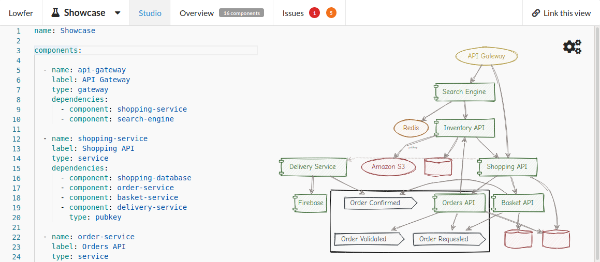
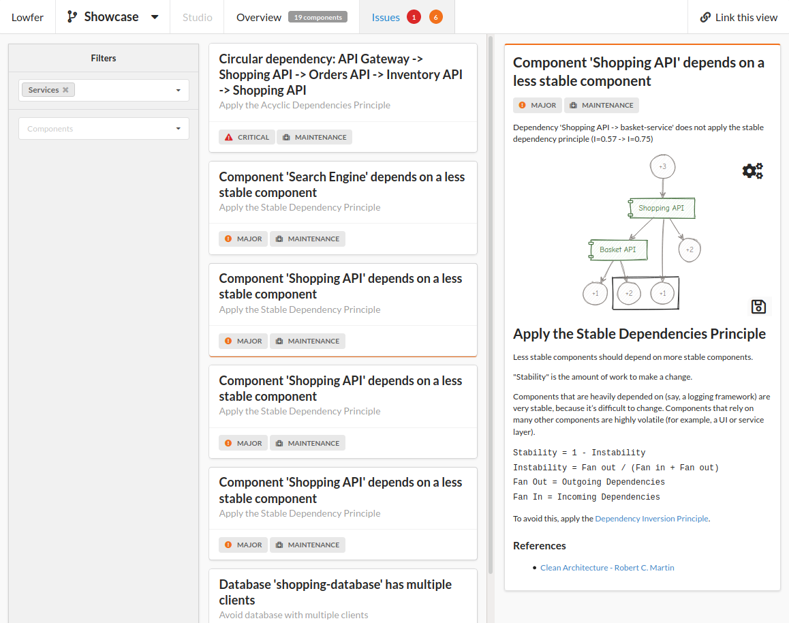

# Lowfer

[](https://opensource.org/licenses/Apache-2.0) &nbsp;
[](https://github.com/mbouchenoire/lowfer/actions/workflows/ci-cd.yml)
[](https://hub.docker.com/r/mbouchenoire/lowfer) &nbsp;

Lowfer is a simple tool that helps software engineers and architects document,
discuss & analyse software design and architecture.

Define your architecture using YAML files and host them in a Git repository, 
Lowfer will then use this repository as it's "database". 

Using a Git repository as a source of truth for your architecture definition allows 
you to treat your architecture like any software component (with versioning, reviews, etc...).

## Features

### Web Studio
Live-edit your architecture definition within a Web IDE:


### Issues
Find issues in your architecture using a built-in static-analysis tool:



## Quick Start

Lowfer is contained within a single Docker image, you can
You can use Lowfer locally in your browser at http://localhost:8080 using Docker only:

```shell script
docker run \
    -e ARCHITECTURES_REPOSITORY_URI=https://github.com/mbouchenoire/lowfer.git \
    -e ARCHITECTURES_REPOSITORY_BRANCH=master \
    -e ARCHITECTURES_REPOSITORY_PATH=src/test/resources/architectures/demo \
    -p 8080:8080 \
    mbouchenoire/lowfer:latest
```
